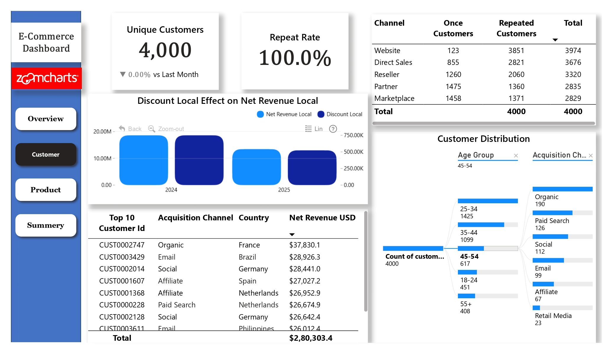

# E-commerce-Dashboard-November-2025-Onyx-DataDNA-Challenge

This project is an end-to-end **E-Commerce Sales & Customer Analytics Dashboard** built using data analysis techniques and interactive visualizations.
It provides insights into **overall performance (2 years)**, **year-wise trends (2024 & 2025)**, **customer behaviors**, and **product performance** to support data-driven business decisions.

---

## 🚀 **Project Overview**

This dashboard analyzes two years of E-Commerce data to understand:

* Revenue trends
* Customer acquisition and retention
* Product performance
* Market segmentation
* Payment & channel contribution
* Pricing, discount & order behavior

The dashboard has **three main sections**:

1. **Overall View** – Combined insights for two years
2. **Customer Analysis** – Customer profile, retention, and buying behavior
3. **Product Analysis** – Best-selling products, pricing, and discounts impact

---

## 🛠️ **Features**

### **🔹 Overall Analysis**

* Total revenue trend (2-year comparison)
* Contribution by sales channels
* Payment methods breakdown
* Top-performing countries
* New vs recurring customers
* A consolidated action plan for high-level strategy

### **🔹 Customer Analysis**

* Top 10 customers by net revenue
* Country-wise & age-group performance
* Customer acquisition drop/growth
* High-value customer segments
* Year-wise customer behavior insights
* Action plan focused on customer growth

### **🔹 Product Analysis**

* Best-selling products
* Top 3 products market trend
* Average selling price (ASP)
* Discount impact on revenue & quantity
* Product mix contribution
* Additional KPI: Pricing & Discount Influence Score
* Action plan for product improvement

---

## 📈 **Key Insights (Sample)**

> *(Replace with your exact dashboard findings if needed)*

### **📌 Overall (2024 + 2025)**

* Total revenue showed a slight downward trend
* Website remains the strongest sales channel (45–46% contribution)
* 55–56% orders are paid using credit cards
* Customer acquisition dropped YoY
* France, Germany, Brazil & Spain remain strong markets

### **📌 2024 Insights**

* Strong revenue growth in early months
* Higher customer retention
* Strong product mix performance

### **📌 2025 Insights**

* Dip in customer acquisition
* Revenue declined due to lower high-value customers
* Some products lost market traction

---

## 🎯 **Action Plan**

* Improve customer acquisition through targeted ads, SEO & retargeting
* Focus marketing on **25–34 age group**, the strongest segment
* Strengthen website performance & user experience
* Improve product pricing strategy and optimize discounting
* Boost performance in high-potential markets
* Enhance product assortment based on demand patterns

---

## 🧰 **Tech Stack**

* **Data Cleaning & Preparation:** Python / Excel / SQL *(choose yours)*
* **Visualization Tool:** Power BI / Tableau *(choose yours)*
* **Dataset Size:** 2-year e-commerce transaction dataset

---

## 🖼️ **Dashboard Preview**

## 📊 Dashboard Visuals

### 🟦 Overall Analysis


### 🟩 Customer Analysis


### 🟧 Product Analysis


```

---
## 👨‍💻 Author

**Vishal**
Data Analyst | Excel · SQL · Python · Tableau/Power BI
Feel free to connect for feedback or collaboration!

---
